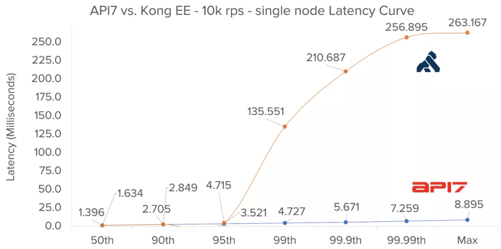
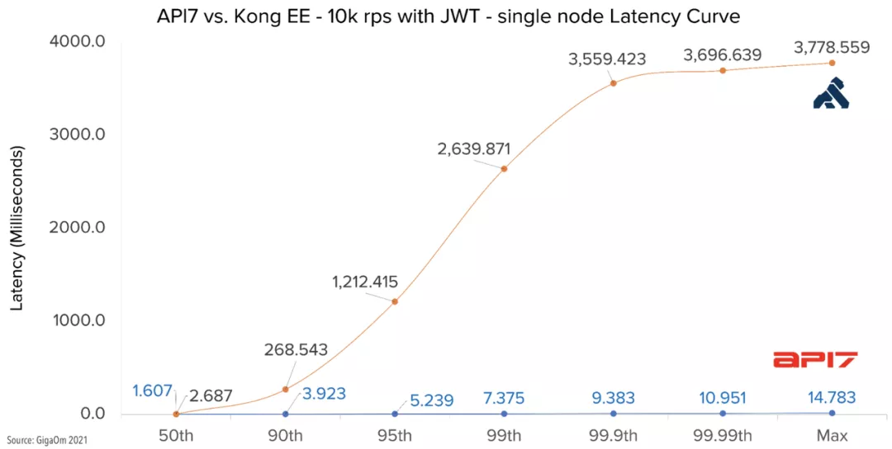
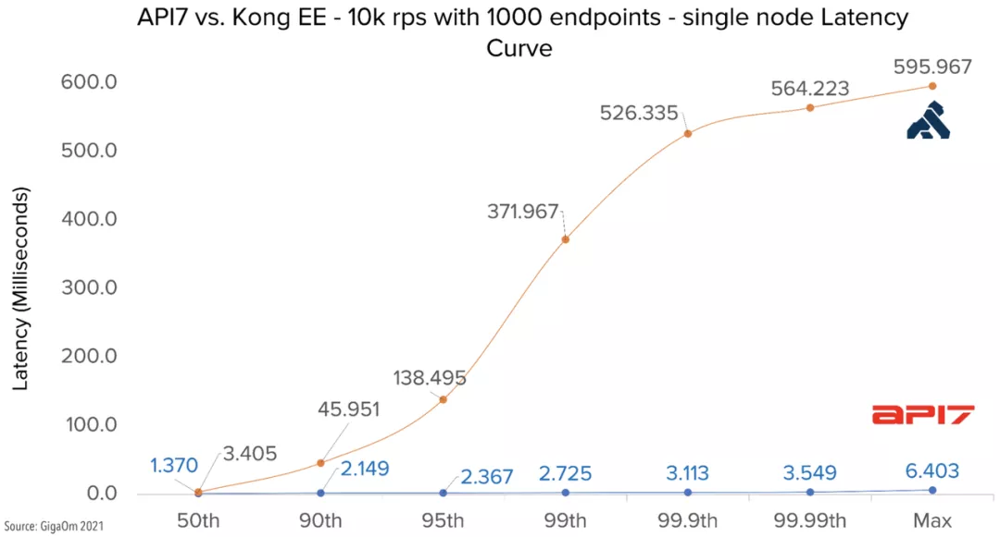

近期，GigaOm 发布了一份 API 网关的性能评测报告，报告主要介绍了在不同压测场景下， API7（基于 Apache 顶级项目 APISIX 的企业版本） 和 Kong EE（Kong 企业版本） 二者的性能差异，**结果显示 API7 性能明显优于 Kong EE，最高有数百倍的差距。**

我们从完整的报告中摘录了测试场景和数据：

1. 1 万 rps 的压测，1 条路由，不启用插件
2. 1 万 rps 的压测，1 条路由，启用 JWT 插件
3. 1 万 rps 的压测，1000 条路由

下面图表中，横坐标表示请求的分布百分比，纵坐标表示延迟的毫秒数。所以，延迟越低越好，越稳定越好。这表示网关可以稳定、高效的处理终端请求。

下图是在不启用任何插件的情况下，APISIX 和 Kong 企业版的延迟对比。对于 95% 请求而言差异很小，但在 95% 之后延迟差异随后呈指数级增长，**在达到 99.99 % 时，Kong EE 的延迟是 API7 的 30 多倍。**

横坐标表示请求的分布百分比，纵坐标表示延迟的毫秒数，数值越小说明性能越好。

在启用了 JWT 插件后，API7 和 Kong EE 的性能差距进一步拉大：Kong EE 的最大延迟到了 3778 毫秒，处于不可用状态，而同时 **API7 的最大延迟仅有 14 毫秒，两者是数百倍的差距。**

横坐标表示请求的分布百分比，纵坐标表示延迟的毫秒数，数值越小说明性能越好。

上面两个场景都只有 1 条路由，在用户的实际生产环境，一般会有几百上千条路由。所以，下面的测试覆盖了 1000 条路由的情况。**在这个场景下，Kong EE 和 API7 也是接近 100 倍的差距。**

横坐标表示请求的分布百分比，纵坐标表示延迟的毫秒数，数值越小说明性能越好。

API7 在各种测试场景下，都保持了低延迟和稳定，这对于企业用户尤为关键。

## API7

Apache APISIX 是新一代的云原生 API 网关，提供丰富的流量管理功能，如负载均衡、动态上游、灰度发布、服务熔断、身份验证、可观测性等。

API7 是深圳支流科技基于 Apache APISIX 实现的商业产品，除了包括上面提到基础功能外，还针对企业用户实现了多集群管理、多工作分区、权限管理、版本管理、审计、统计等功能。
